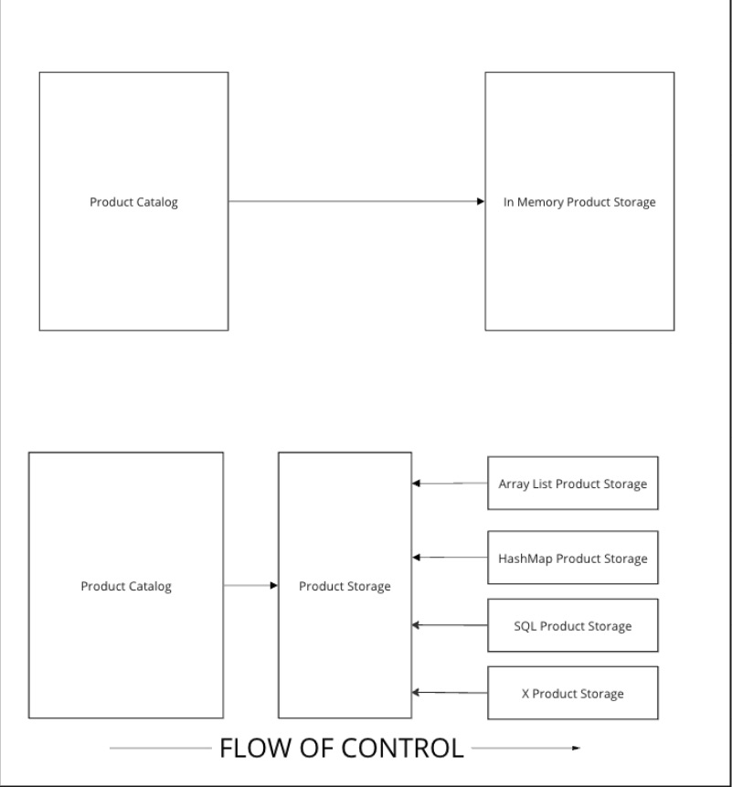
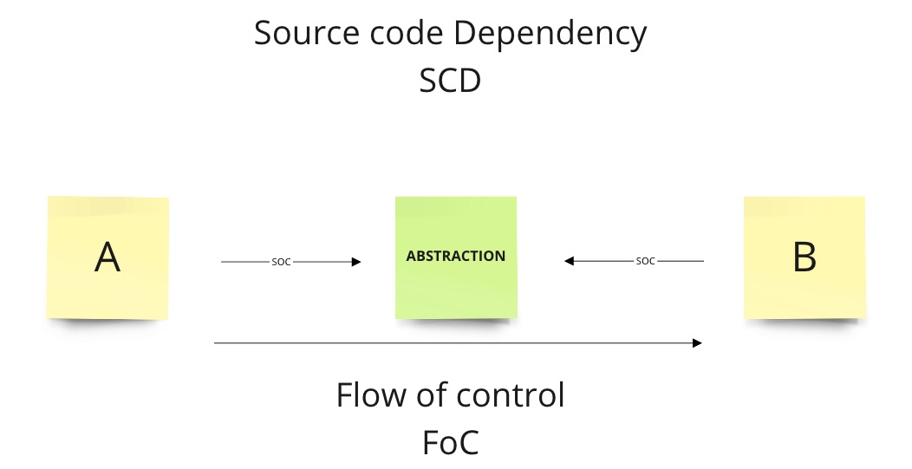
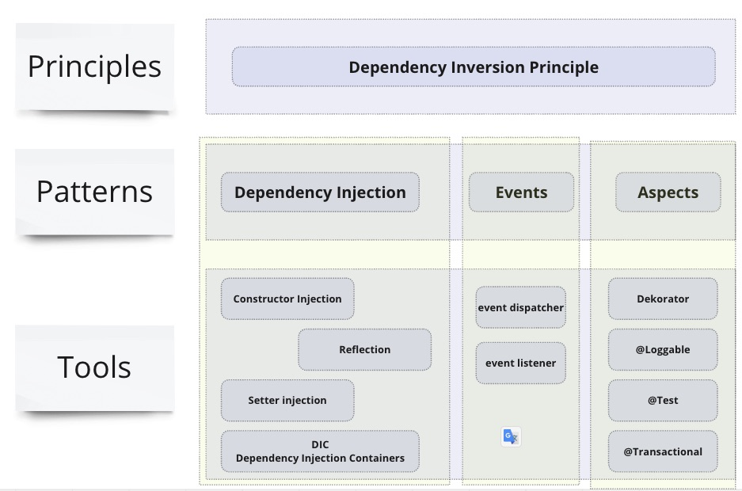

# Dependency Inversion with Dependency Injection

In order to benefit from persistent storage for products, lets modify our catalog towards 
that direction

### ToDoes
- Identify product storage responsibilities
- Extract storage responsibilities to separate file
- Refactor to allow construct ProductCatalog with ProductStorage provided externally
- Extract formal definition of product storage with ProductStorage Interface

### Module A & B do not depends on each other

## Essential Shortcuts
* Refactor > Extract interface

## Files
* [src/main/java/pl/jkanclerz/ecommerce/catalog](../src/test/java/pl/jkanclerz/ecommerce/catalog)
* [src/main/java/pl/jkanclerz/ecommerce/catalog/ArrayListProductStorage.java](../src/main/java/pl/jkanclerz/ecommerce/catalog/ArrayListProductStorage.java)
* [src/main/java/pl/jkanclerz/ecommerce/catalog/ProductStorage.java](../src/main/java/pl/jkanclerz/ecommerce/catalog/ProductStorage.java)

* [src/test/java/pl/jkanclerz/ecommerce/catalog/HashMapProductStorageTest.java](../src/test/java/pl/jkanclerz/ecommerce/catalog/HashMapProductStorageTest.java)

## Dictionary
* Inversion of Control
* Dependency Inversion
* Dependency Injection
* Event Oriented Architecture
* Aspect Oriented Programming

